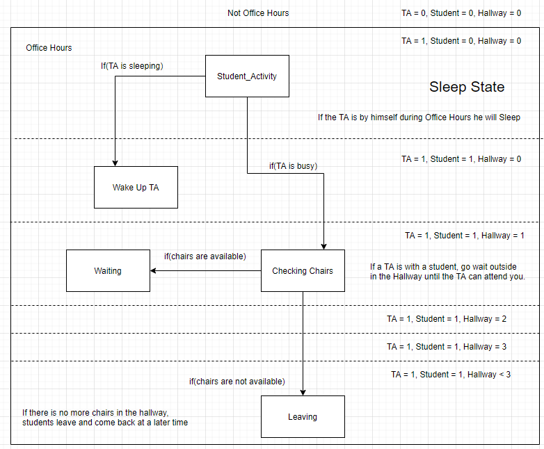
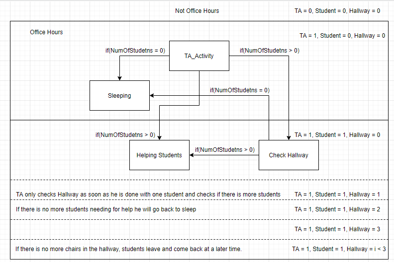

# SleepingTeachingAssistant
  
  
 
Team Members: 
	1. Mauricio Macias, CPSC 351-01, mauricio.macias@csu.fullerton.edu  
	2. Cassandra Kobayashi, CPSC 351-01, ckobayashi@csu.fullerton.edu  
 
Programming language used: C++  
	
How the run program:  
	1. On a Linux PC, open folder containing executable  
	2. Right-click white space click on "Open Terminal Here"  
	3. In the Terminal window  
		a. compile file: 'g++ TA.cpp -lpthread -o TA'  
		b. run file ./TA  
	
Team collaboration on the project:  
	1. Mauricio: Started the first half of the project: 
		a. Initializing Mutex Lock and Semaphores.  
		b. Created and Waiting TA threads and N Student threads.  
		c. Started the README file  
		d. Started the "Design of Sleeping Teaching Assistant"  
		
	2. Cassandra: Finished second half of the project;  
		a. Completed *TA_Activity() function.  
		b. Completed *Student_Activity() function  
		c. Completed README file added test run screenshot  
		d. Completed the "Design of Sleeping Teaching Assistant"  
